# Switch bouncing traces

This repository contains a collection of example traces showing switch bouncing behaviour. This may be useful if you want some quick reference data for implementing robust debouncing systems in your circuits and firmware.

## Devices tested

| Device                                                       | Type                          | Notes                                                        |
| ------------------------------------------------------------ | ----------------------------- | ------------------------------------------------------------ |
| [Multicomp MC3813-011-01](https://uk.farnell.com/multicomp/mc3813-011-01/rocker-switch-dpst-black/dp/9562273) ([archive](https://web.archive.org/web/20250503230142/https://uk.farnell.com/multicomp/mc3813-011-01/rocker-switch-dpst-black/dp/9562273), [datasheet](https://web.archive.org/web/20250503230917/https://www.farnell.com/datasheets/323310.pdf)) | Rocker switch, latching, DPST | Only one pole tested.                                        |
| Schurter 1301.9206 ([archived catalogue](https://web.archive.org/web/20240815094223/https://www.farnell.com/datasheets/12277.pdf)) | Rocker switch, latching, SPST | Old part, been in my drawer for over ten years.              |
| [Schneider XB2-BW31B1C](https://www.lcsc.com/product-detail/Button-Signal-Lamp-Main-Switch_Schneider-XB2-BW31B1C-ZB2BWB11C-ZB2BW31C_C514771.html) ([archive](https://web.archive.org/web/20250503230702/https://www.lcsc.com/product-detail/Button-Signal-Lamp-Main-Switch_Schneider-XB2-BW31B1C-ZB2BWB11C-ZB2BW31C_C514771.html), [datasheet](https://web.archive.org/web/20250503230712/https://wmsc.lcsc.com/wmsc/upload/file/pdf/v2/lcsc/2005211533_Schneider-XB2-BW31B1C--ZB2BWB11C-ZB2BW31C_C514771.pdf)) | Push button, momentary, NO    | Very large industrial pushbutton.                            |
| [XKB Connection TC-1103-B-A](https://www.lcsc.com/product-detail/tactile-switches_xkb-connection-tc-1103-b-a_C318979.html) ([archive](https://web.archive.org/web/20250503231039/https://www.lcsc.com/product-detail/tactile-switches_xkb-connection-tc-1103-b-a_C318979.html), [datasheet](https://web.archive.org/web/20250503231038/https://wmsc.lcsc.com/wmsc/upload/file/pdf/v2/lcsc/2410010002_XKB-Connection-TC-1103-B-A_C318979.pdf)) | Push button, momentary, NO    |                                                              |
| [Dailywell MPS22-A03FP-3-JR-3V](https://www.lcsc.com/product-detail/Button-Signal-Lamp-Main-Switch_Dailywell-MPS22-A03FP-3-JR-3V_C508428.html) ([archive](https://web.archive.org/web/20250503231310/https://www.lcsc.com/product-detail/Button-Signal-Lamp-Main-Switch_Dailywell-MPS22-A03FP-3-JR-3V_C508428.html), [datasheet](https://web.archive.org/web/20250503231304/https://wmsc.lcsc.com/wmsc/upload/file/pdf/v2/lcsc/2409302230_Dailywell-MPS22-A03FP-3-JR-3V_C508428.pdf)) | Push button, momentary, NO    | IP67 / IK10 rated                                            |
| [Dailywell KPB22-8000-F10-324-JQ](https://www.lcsc.com/product-detail/Push-Switches_Dailywell-KPB22-8000-F10-324-JQ_C508434.html) ([archive](https://web.archive.org/web/20250503231439/https://www.lcsc.com/product-detail/Push-Switches_Dailywell-KPB22-8000-F10-324-JQ_C508434.html), [datasheet](https://web.archive.org/web/20250503231501/https://wmsc.lcsc.com/wmsc/upload/file/pdf/v2/lcsc/2409302301_Dailywell-KPB22-8000-F10-324-JQ_C508434.pdf)) | Push button, momentary, SPDT  | IP65 rated. NO and NC traces recorded.                       |
| [Lorin IRL-5-M-D-2](https://uk.farnell.com/lorlin/irl-5-m-d-2/keyswitch-dpdt-taper-bezel-diff/dp/1876052) ([archive](https://web.archive.org/web/20250503231730/https://uk.farnell.com/lorlin/irl-5-m-d-2/keyswitch-dpdt-taper-bezel-diff/dp/1876052), [datasheet](https://web.archive.org/web/20240627010238/https://www.farnell.com/datasheets/1295507.pdf)) | Key switch, momentary, DPDT   | Only one pole recorded, only NO trace recorded as the NC legs were cut off. |

## Test conditions

The switches were configured as pull-downs, i.e. opening the switch leaves the voltage a +5.0V, and closing the switch pulls the output voltage to ground.

All traces were collected using the same procedure and equipment:

- Connect 5.0V to one terminal of the switch through a 10kΩ resistor.
- Connect 0.0V to the other terminal of the switch, directly.
- Measure voltage across the switch.
  - 250MHz probe (x1)
  - PicoScope 3206B recording at 8.93MSa/s
  - 2V trigger, 1.5% hysteresis, 20% pre-trigger, both edges
- Press the button 32 times, resulting in 64 total traces (rising/falling edges)
  - Approximately 8 presses in 1 second spacings (holding for momentary).
  - Approximately 8 presses in rapid succession.
  - Approximately 8 presses with light or glancing actuation.
  - Approximately 8 presses with heavy force.
- If the switch is double-throw, record measurements for both the NO and NC contacts.

## Plots

These plots show 32 opening and 32 closing actions on top of each other for each device.

Remember that the switches were configured as pulldowns, so high voltage = open, low voltage = closed.

### Multicomp MC3813-011-01

#### Falling edge (switch closing)

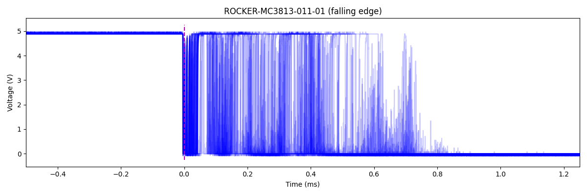

#### Rising edge (switch opening)

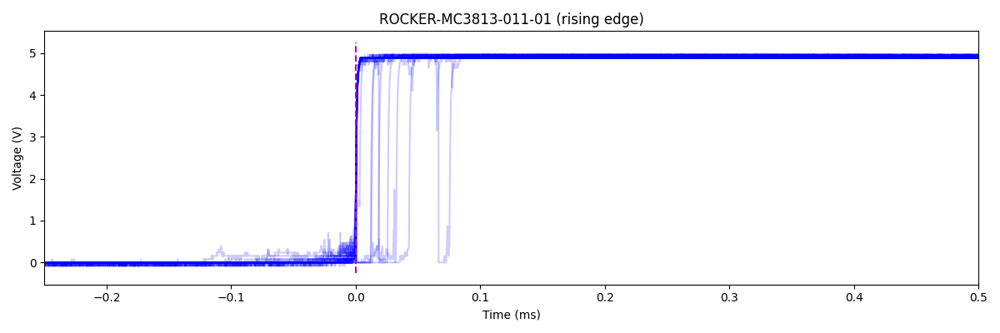

### Schurter 1301.9206

#### Falling edge (switch closing)

#### Rising edge (switch opening)

### Schneider XB2-BW31B1C

#### Falling edge (switch closing)

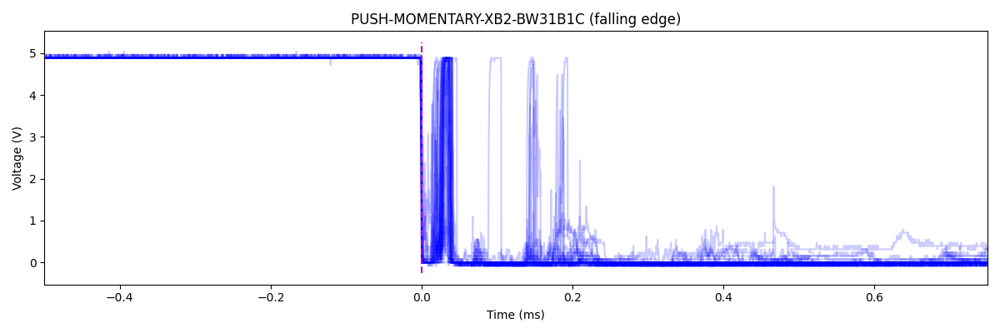

#### Rising edge (switch opening)

### XKB Connection TC-1103-B-A

#### Falling edge (switch closing)

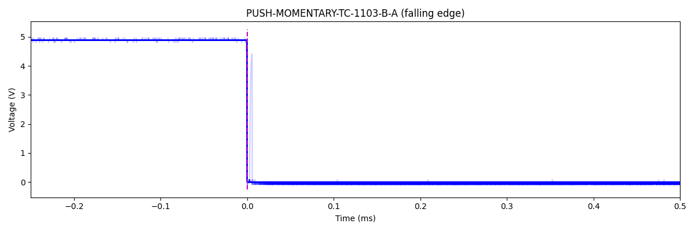

#### Rising edge (switch opening)

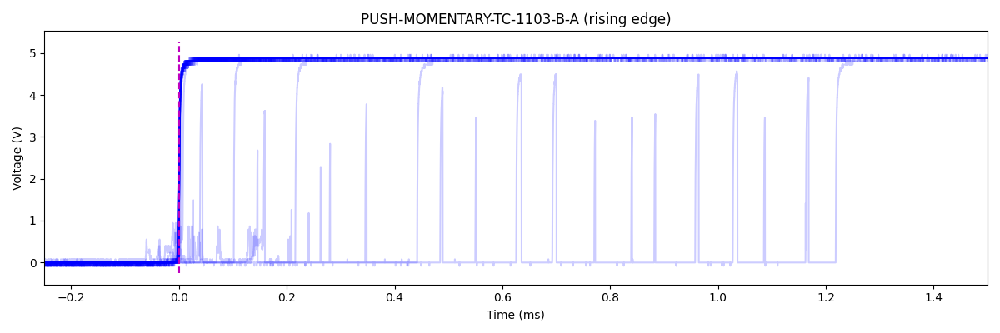

### Dailywell MPS22-A03FP-3-JR-3V

#### Falling edge (switch closing)

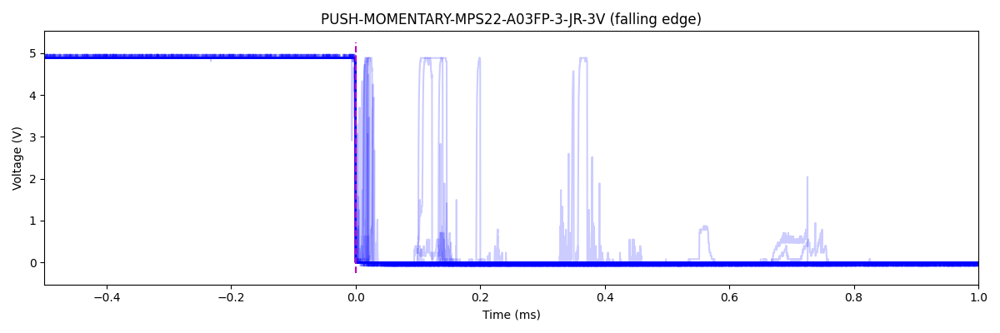

#### Rising edge (switch opening)

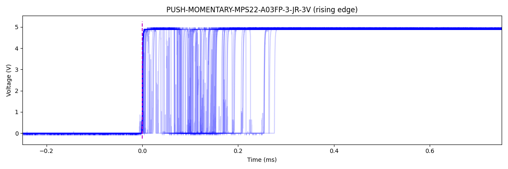

### Dailywell KPB22-8000-F10-324-JQ

#### N/O falling edge (switch closing)

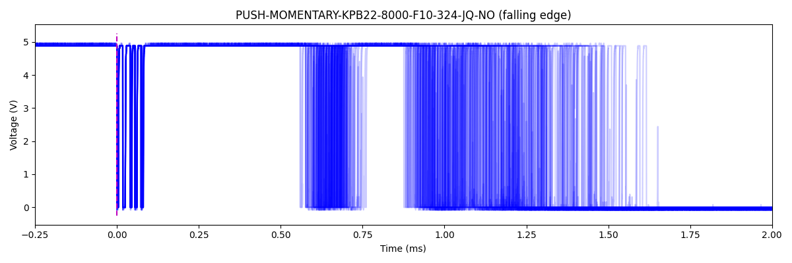

#### N/O rising edge (switch opening)

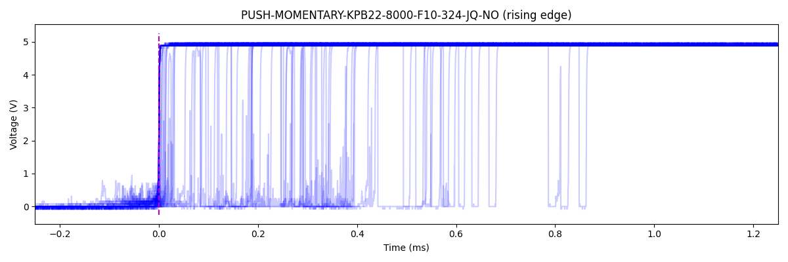

#### N/C falling edge (switch closing)

#### N/C rising edge (switch opening)

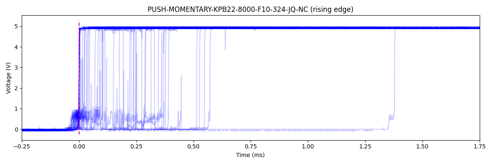

### Lorin IRL-5-M-D-2

#### Falling edge (switch closing)

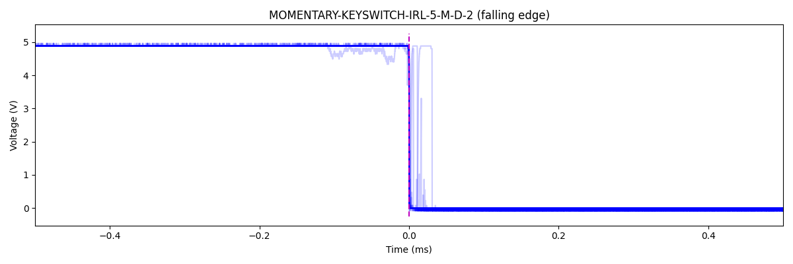

#### Falling edge (switch opening)

## Raw data

The raw data is available to download under this repository's releases section. The data is formatted as a CSV with a header, with each device in its own directory. For double-throw devices that have both normally-open and normally-closed forms, the device will have two directories suffixed with `-NO` and `-NC` respectively.

Voltages are simply in volts. Timestamps are in milliseconds. A timestamp of zero signifies the time at which the oscilloscope was triggered by a rising or falling edge. Negative timestamps are before the trigger, positive after the trigger.

## License

Everything in this repository is released into the public domain.

